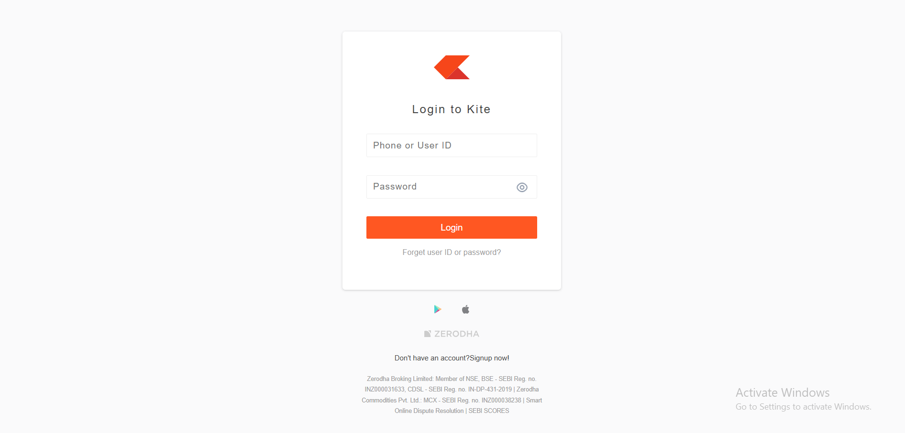

# Zerodha-Login-page

# Zerodha Login Page Clone

This is a simple **login page UI clone of Zerodha Kite**, created using basic **HTML5** and **CSS3**. The goal of this project is to practice frontend layout design, form creation, and custom styling.

---

## 🚀 Features

- Fully structured and styled login card
- Inputs for User ID/Phone and Password
- Eye icon for future password visibility feature
- Custom-styled login button
- “Forget user ID or password?” message
- Footer with:
  - App download icons (Android and Apple)
  - Zerodha brand logo
  - Legal and company address information
- Mobile-friendly layout with centered positioning
- Added `letter-spacing` for typography enhancement

---

## 📁 Folder Structure

zerodha-login-page/
│
├── index.html # Main HTML page
├── index.css # External CSS styling
└── README.md # Project documentation

---

## 🛠️ Technologies Used

- HTML5 (Semantic tags like `header`, `footer`, `form`, `input`)
- CSS3 (Box model, Flexbox, Shadows, Typography)

---

## 🎨 UI Design Breakdown

### 🔹 Header
- Displays the Zerodha Kite logo using an external image link.

### 🔹 `<h2>` Title
- Text: "Login to Kite"
- Uses `letter-spacing: 2px` and custom font style to resemble original branding.

### 🔹 Login Form
- Includes input fields:
  - **Username/Phone**
  - **Password**
- Styled with border radius, shadows, and spacing.
- Eye icon image placed absolutely (styled for future toggle feature).
- Submit button styled with color `#ff5722`.

### 🔹 Footer
- Includes:
  - Android and Apple app icons
  - Zerodha footer logo
  - Text prompting new user signup
  - Address with company registration info and legal links

---

## 📲 How to Run

1. Download or clone the repository:

   git clone https://github.com/Venkateshthullibilli/Zerodha-Login-page.git

## Preview
